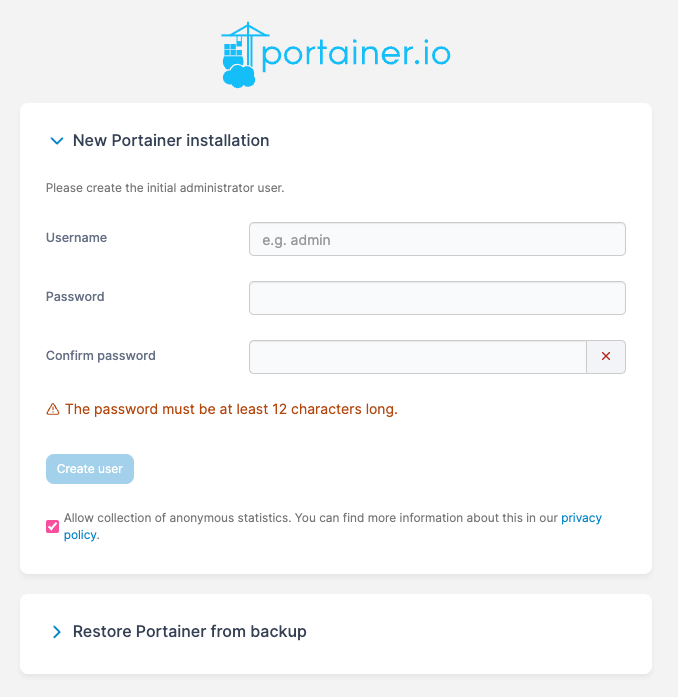
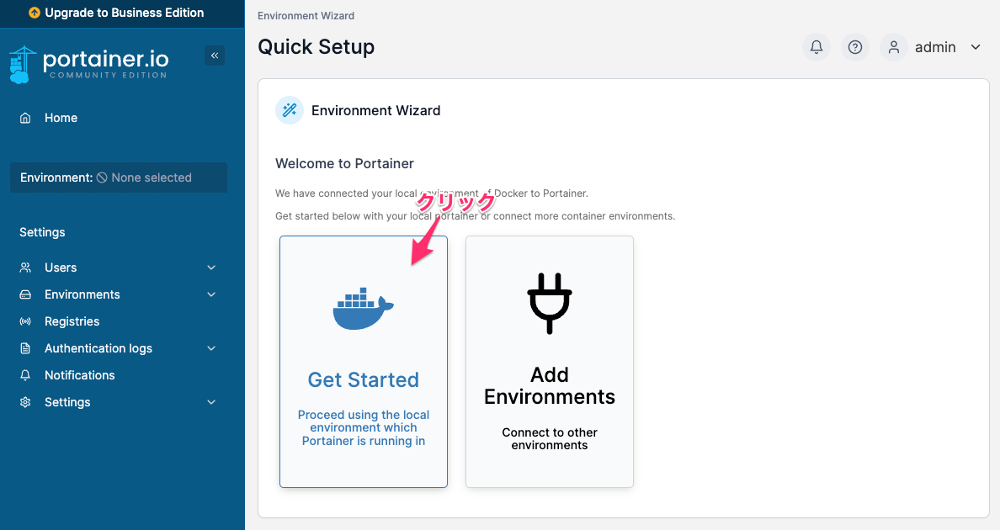
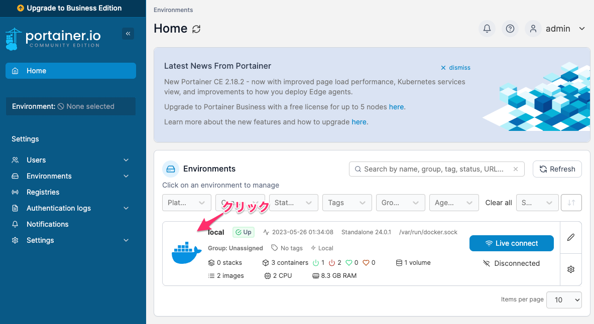
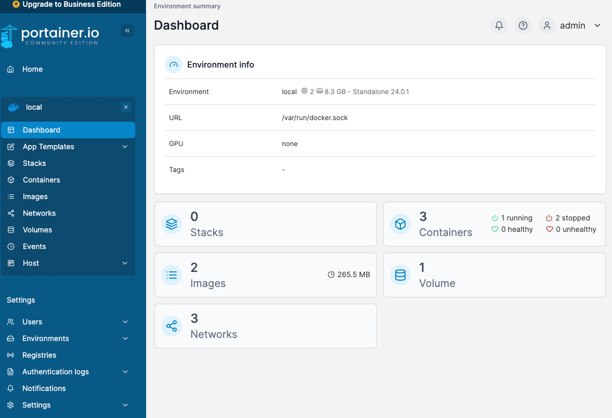

Portainerのセットアップ
===

DockerのGUIとして、「Portainer」をセットアップしていく。  

# 1. volume 作成

```bash
docker volume create portainer_data
```

# 2. 起動

```bash
docker run -d \
-p 9000:9000 \
--name portainer \
--restart always \
-v /var/run/docker.sock:/var/run/docker.sock \
-v portainer_data:/data \
portainer/portainer-ce
```

# 3. ブラウザからアクセス

ブラウザから「http://localhost:9000」でアクセスすると、初期設定画面が表示される。  
※ポート番号は、[UTMの設定](./UTM.md)の 3-9 にて実施。  

必要事項を入力する。  


↓↓  
Quick Setup画面にて「Get Started」をクリック。  


↓↓
Home画面には、現在VM内で動いている「local」のDockerがあるので、それをクリック。  


# 4. ダッシュボード
Docker Desktop では表示されない Docker Network も表示できるのが Portainerのいいところ。

