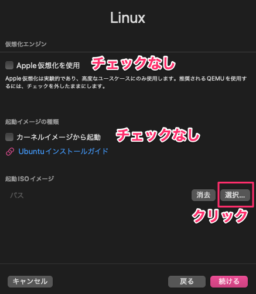
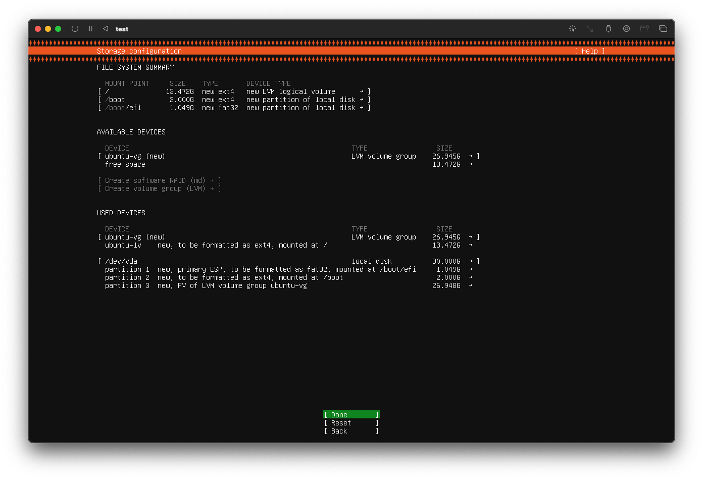
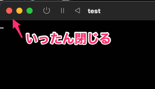

UTMでLinux VMを構築する
===

# 1. UTM をインストール

- App Store 版は有料。
- [サイト](https://getutm.app/) からダウンロード。(サポートなし)

# 2. ARM版Ubuntu Serverをダウンロード
[ARM版のUbuntu Server](https://ubuntu.com/download/server/arm) の ISO イメージをダウンロード。  
今回は22.04.02 LTS を取得。

# 3. UTMでVMを作成
むちゃくちゃ簡単。

## 3-1. 「+」ボタンをクリック

## 3-2. 「仮想化」をクリック

## 3-3. 「Linux」をクリック

## 3-4. 仮想化エンジンの設定
- 「Apple仮想化を使用」はチェック入れない。
-  「カーネルイメージから起動」はチェックいれない。
- 「起動ISOイメージ」の選択ボタンをクリック。

## 3-5. ハードウェア
- メモリ、CPUコアは、自分の端末に適した量を指定する。
- 今回はDocker用途なので、OpenGLは使用しない。

## 3-6. ストレージ
- ここも、自分の端末に適した量を指定する。
- 30GBもあれば充分？

## 3-7. 共有ディレクトリ

開発に必要なソースファイルはホスト側に置くので、共有ディレクトリとして指定しておく。

## 3-8. 概要

先程まで設定した内容の確認画面が表示される。  
名称はわかりやすくしたほうがいい。

# 4. Ubuntuのインストール

## 4-1. 
作成したVMを選択し、起動ボタンをクリック。

## 4-2. 
`Try or Install Ubuntu Server`を選択。

言語は「English」を選択。日本語はない。

キーボードレイアウトは、自分が使っているキーボードを指定し、「Done」で次の設定へすすむ。  
(ここには「Japanese」がある)  

## 4-3. 
インストールタイプを選択。
Dockerデーモンを実行するための最小構成で構築したいので、「Ubuntu Server (minimized)」を選択し「Done」を選択。

## 4-4. 
ネットワークはそのままではDHCPによるIPアドレス指定になるため、固定にする。  
ネットワークカード名のところまでカーソルを移動しenterキーで選択.  

「Edit IPv4」を選択。

「IPv4 Method」が「Automatic (DHCP)」となっているので、enterキー押下から「Manual」を選択。  

IPアドレスを設定。  
今回セットアップしたVMは「192.168.64.3」だったので、それを踏襲。  
DHCP から static に変わっている。    
  

プロキシサーバーの設定が必要ない場合は、そのまま「Done」。  

ミラーサーバーは、自動的に近くのサーバーが指定される。  

## 4-5.
ストレージのパーティーションはデフォルト。  
「Done」ですすめるとレイアウトが表示される。
   
 

## 4-6. 
最終確認ダイアログが表示されるので「Continue」を選択。  
 

## 4-7.
ユーザープロフィール設定。  
コンソールなどで表示されるユーザー名は、３項目名のところ。
 

## 4-8.
「Ubuntu Pro」へのアップグレードを勧められるが、スキップ（赤枠）を選択。  
 

## 4-9.
Dockerはコンソールで操作する予定なので、SSHコンソールができるようにする。  
 

## 4-10.
インストールするサーバーパッケージの選択。  
今回はUbuntuになれるため、Docker は敢えてコマンドからインストールしたいので、ここでは無選択とする。  
 

## 4-11.
インストール中は記号がクルクル周り、インストールが終わると「Reboot」が表示されるので、再起動を行う。  
 
 

## 4-12.
真っ黒な画面になるので、一旦ウィンドウを閉じる。
  
 

## 4-13.
作成したVMにはまだISOイメージファイルがセットされているので、開放(消去)し、VMを再起動する。  
 

# 5. 再起動後
再起動後、ログインプロンプトが表示されるので、4-4. で設定したユーザー名とパスワードを入力してログインする。
 

つづきは、[こちら](./UBUNTU.md)でUbuntuの設定を行っていく。